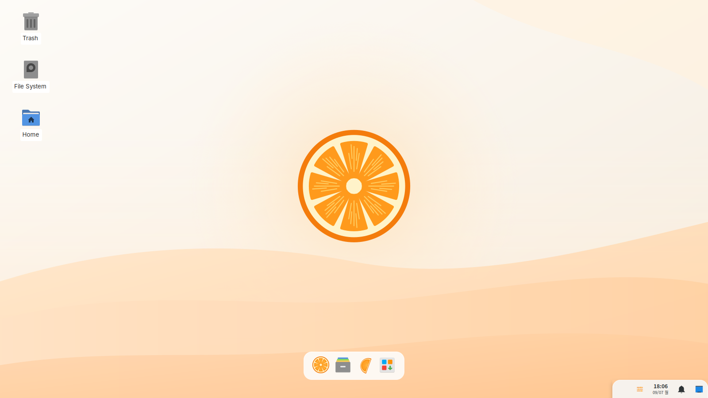
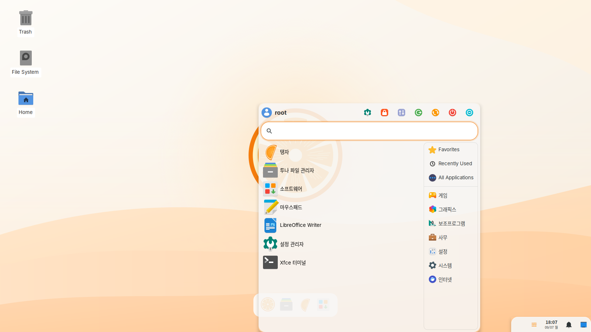
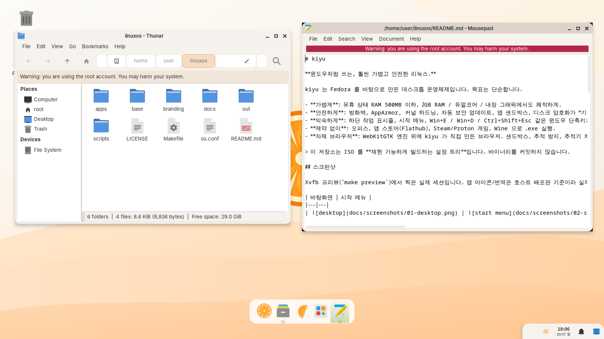
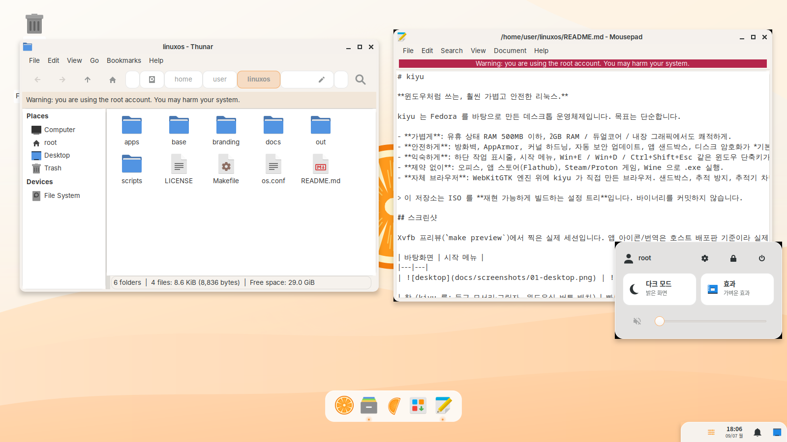
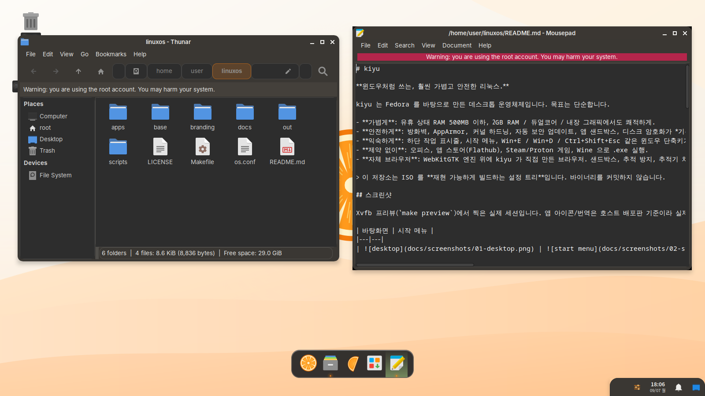
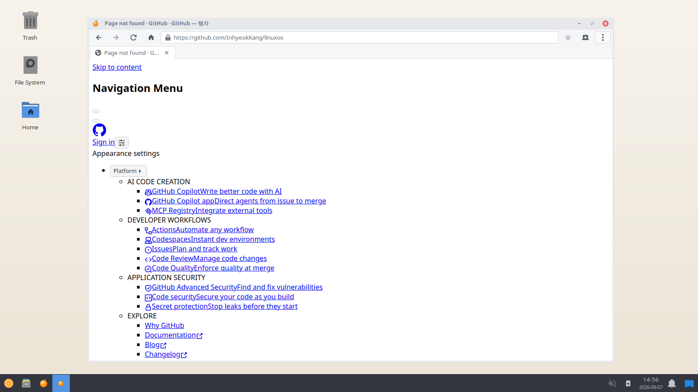

# kiyu

**윈도우처럼 쓰는, 훨씬 가볍고 안전한 리눅스.**

kiyu 는 Fedora 를 바탕으로 만든 데스크톱 운영체제입니다. 목표는 단순합니다.

- **가볍게**: 유휴 상태 RAM 500MB 이하, 2GB RAM / 듀얼코어 / 내장 그래픽에서도 쾌적하게.
- **안전하게**: 방화벽, AppArmor, 커널 하드닝, 자동 보안 업데이트, 앱 샌드박스, 디스크 암호화가 *기본값*.
- **익숙하게**: 하단 작업 표시줄, 시작 메뉴, Win+E / Win+D / Ctrl+Shift+Esc 같은 윈도우 단축키가 그대로.
- **제약 없이**: 오피스, 앱 스토어(Flathub), Steam/Proton 게임, Wine 으로 .exe 실행.
- **자체 브라우저**: WebKitGTK 엔진 위에 kiyu 가 직접 만든 브라우저. 샌드박스, 추적 방지, 추적기 차단이 기본값 ([docs/browser.md](docs/browser.md)).

> 이 저장소는 ISO 를 **재현 가능하게 빌드하는 설정 트리**입니다. 바이너리를 커밋하지 않습니다.

## 스크린샷

Xvfb 프리뷰(`make preview`)에서 찍은 실제 세션입니다. 앱 아이콘/번역은 호스트 배포판 기준이라 실제 ISO 와 조금 다를 수 있습니다.

| 바탕화면 (Plank 독 + 오른쪽 알약) | 시작 메뉴 (독의 kiyu 로고 또는 Win 키) |
|---|---|
|  |  |

| 창 (kiyu 룩: 둥근 모서리·그림자, 윈도우식 버튼 배치) | 빠른 설정 (Win+A) |
|---|---|
|  |  |

| 다크 모드 (빠른 설정에서 한 번에 전환) | |
|---|---|
|  | |

| 탱자 새 탭 | HTTPS 사이트 (프록시 환경이라 외부 CSS 는 차단됨) |
|---|---|
|  |  |

## 빠른 시작

```bash
# Fedora (또는 fedora:44 컨테이너) 에서
sudo dnf install kiwi-cli kiwi-systemdeps librsvg2-tools
git clone https://github.com/inhyeokkang/linuxos.git && cd linuxos
make check          # 정적 검사 (빌드 불필요)
make preview        # ISO 없이 데스크톱 UI 미리보기 (Xvfb, 스크린샷 생성)
make build          # ISO 빌드 (20~40분, 약 10GB 디스크 필요)
make test           # QEMU 로 부팅 (2 CPU / 2GB RAM 저사양 재현)
make test-uefi      # UEFI 모드
```

빌드 결과물은 `base/fedora/out/kiyu-0.2.0-x86_64.iso` 입니다. USB 에 그대로 쓰면(예: `dd`, Rufus, balenaEtcher) BIOS 와 UEFI(Secure Boot 포함) 모두에서 부팅됩니다. GitHub Actions 의 **Build ISO** 워크플로가 같은 것을 만들고 QEMU 로 부팅 테스트까지 합니다.

## 무엇이 들어 있나

| 영역 | 선택 | 이유 |
|---|---|---|
| 베이스 | Fedora 44 | 최신 커널·드라이버, SELinux 기본, 강한 보안 기본값. 13개월 지원 주기는 업그레이드 도우미로 대응 ([docs/fedora-migration.md](docs/fedora-migration.md)) |
| 데스크톱 | XFCE 4.20 (윈도우 배치) | 유휴 250~350MB, GPU 거의 안 씀, 안정적 |
| 앱 설치 | Flatpak + Flathub, GNOME Software, dnf | 앱 스토어 UX + 샌드박스 |
| 브라우저 | 탱자 브라우저 (WebKitGTK) | 엔진은 Fedora 가 패치, 브라우저는 우리가 만듦. 추적기 차단·샌드박스 기본 |
| 오피스 | LibreOffice (Writer/Calc/Impress) | MS Office 파일 호환, 동일 규격 폰트(Carlito/Caladea) 포함 |
| 한국어 | fcitx5-hangul, 본고딕(Source Han Sans KR) 기본 글꼴 | 윈도우 폰트 이름(맑은 고딕 등) 자동 매핑 |
| 게임 | `kiyu-setup-gaming` | Steam(Flatpak) + Proton-GE + GameMode + MangoHud, NVIDIA 드라이버 선택 설치 |
| 윈도우 앱 | `kiyu-setup-windows-apps` | Wine + Bottles, .exe 더블클릭 |
| 설치 | Anaconda | 전체 디스크 암호화, 윈도우 듀얼부팅 |

보안 설계는 [docs/security.md](docs/security.md), 설계 근거는 [docs/architecture.md](docs/architecture.md), 윈도우 사용자용 대응표는 [docs/windows-user-guide.md](docs/windows-user-guide.md) 를 보세요.

## 저장소 구조

```
os.conf                       이름/버전/베이스/미러 (여기만 고치면 됨)
base/fedora/                  기본 베이스 (kiwi-ng)
  kiyu.kiwi                   패키지 목록과 ISO 형식
  config.sh                   빌드 중 이미지 안에서 실행되는 설정 스크립트
  root/                       최종 시스템에 들어갈 파일
    etc/sysctl.d, modprobe.d, firewalld, dnf   보안 기본값
    etc/xdg/xdg-kiyu/         XFCE 윈도우 스타일 기본 설정 (패널, 단축키, 테마)
    usr/lib/kiyu/, usr/local/bin/kiyu-*        세션 도우미, 게임/윈도우앱 설치 스크립트
base/debian/                  0.1 의 Debian live-build 트리 (보존용, 수동 워크플로)
apps/taengja/            탱자 브라우저 (WebKitGTK)
apps/kiyu-superkey/           Win 키 탭 → 시작 메뉴 (C)
branding/                     로고, 배경화면, 부트 스플래시 (SVG)
scripts/                      build.sh, build-fedora.sh, boot-test.sh, preview-desktop.sh, check.sh
docs/                         설계 문서
```

## 커스터마이즈

- **이름/버전 바꾸기**: `os.conf` 수정 후 `grep -ri kiyu config branding` 로 남은 곳 확인.
- **앱 빼고 더하기**: `base/fedora/kiyu.kiwi` 의 `<packages type="image">` 편집.
- **다른 언어 지원**: `kiyu.kiwi` 의 `<locale>`, `glibc-langpack-*`, 폰트·입력기 패키지 교체.
- **포트 열기**: `/etc/nftables/local.d/` 에 `.nft` 파일 추가 후 `sudo systemctl restart nftables` (예시 파일 포함).

## 현재 상태

0.2.0 은 Fedora 베이스로의 전환 단계입니다. 0.1 (Debian) 은 CI 에서 ISO 빌드와 BIOS/UEFI(Secure Boot) 부팅, 자동 로그인, 8초 부팅, 메모리 측정까지 검증됐습니다. Fedora 이미지는 같은 파이프라인으로 검증 중이며 진행 상황은 [docs/roadmap.md](docs/roadmap.md) 에 있습니다.

## 라이선스

빌드 설정과 스크립트는 MIT. 포함되는 소프트웨어는 각자의 라이선스(대부분 GPL/LGPL/MPL)를 따릅니다.
