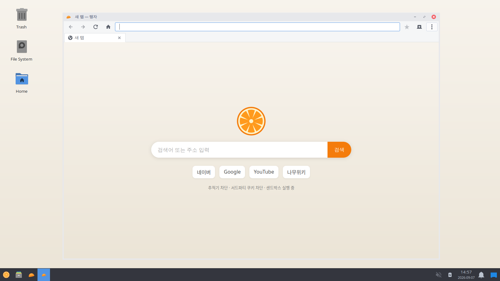

# Taengja — kiyu 의 브라우저, 검토와 설계

이름 **Taengja**(탱자)는 귤(kiyu)과 형제인 과일에서 왔습니다. UI 표기에는 한글 "탱자" 대신 영문 **Taengja** 를 씁니다. 아이콘은 반달처럼 기울인 귤 조각이고, OS 로고인 귤 단면과 짝을 이룹니다.

## 기능 (v0.2)

- 탭, 북마크(Ctrl+D), 페이지에서 찾기(Ctrl+F), 확대(Ctrl +/-/0), 전체 화면(F11), 인쇄(Ctrl+P)
- 방문 기록: 최근 3000개를 저장하고 주소창에서 제목·주소로 자동완성, 메뉴에 최근 방문 8개, 기록 지우기
- 다운로드: 다운로드 폴더에 자동 저장, 도구 모음의 다운로드 버튼(Ctrl+J)에서 진행률·완료 목록과 폴더 열기
- 아직 없는 것: 비밀번호 저장(libsecret 기반으로 계획), 확장 기능(WebKitGTK 는 WebExtensions 미지원), 동기화

## 광고·추적 차단 목록

빌드 때 EasyPrivacy(추적), EasyList(광고, 네트워크 규칙), List-KR(한국 사이트)을 받아 `apps/taengja/abp2webkit.py` 로
WebKit 콘텐츠 차단기 규칙으로 변환해 `/usr/share/taengja/filters/*.json` 에 넣는다. 브라우저는 첫 실행에 이를 컴파일해
캐시하고(이후 즉시 로드), 내장 소형 목록(대표 추적 도메인 + 서드파티 쿠키 차단)과 함께 적용한다. 규칙 수 상한을 두어
컴파일 시간과 메모리를 억제한다. 변환기가 지원하지 않는 규칙($redirect, $csp, 정규식, 일반 요소 숨김 등)은 건너뛴다.

## 질문: "Firefox/Chrome 대신 우리 OS 에서 가장 잘 도는 브라우저를 만들 수 있나?"

**결론: 만들 수 있지만, 엔진은 만들지 않는다.** 브라우저는 두 층으로 나뉩니다.

| 층 | 하는 일 | 규모 | kiyu 의 선택 |
|---|---|---|---|
| **엔진** (HTML/CSS/JS 렌더링, 네트워크, 샌드박스) | 웹 표준 전체 구현, 매주 보안 패치 | 수백만 줄, 수백 명 상근 | **WebKitGTK** 를 쓴다 |
| **브라우저** (창, 탭, 주소창, 설정, 차단, 권한, 프로필) | 사용자가 만지는 전부 | 수천~수만 줄 | **kiyu 가 직접 만든다** |

엔진을 새로 쓰는 것은 현실적으로 불가능합니다. 현존하는 독립 엔진은 Blink(Google), Gecko(Mozilla), WebKit(Apple) 셋뿐이고, Servo·Ladybird 같은 신생 프로젝트도 10년 가까이 개발 중이지만 일상 사용 단계가 아닙니다. 보안 관점에서도 엔진은 취약점이 가장 많이 발견되는 자리라 대형 조직의 상시 대응이 필요합니다.

반면 브라우저 층은 다릅니다. Brave·Vivaldi·Arc 가 Chromium 위에, GNOME Web(Epiphany)·Orion 이 WebKit 위에 각자의 브라우저를 만든 것처럼, **엔진을 가져다 우리 OS 에 맞춘 브라우저**가 정석입니다.

## 엔진 후보 비교

| | WebKitGTK | Chromium (CEF/포크) | Gecko | Servo / Ladybird |
|---|---|---|---|---|
| 배포판 보안 패치 | Fedora·Debian 이 패키지로 배포, 2~4주 주기 | 직접 빌드·배포해야 함 (빌드 4~8시간, 100GB) | 임베딩 API 없음 (Firefox 전용) | 미성숙 |
| 메모리 | 가장 가벼움 (탭당 프로세스, 캐시 제어 가능) | 무거움 | — | — |
| 샌드박스 | bubblewrap + seccomp (Flatpak 과 같은 기술) | 자체 샌드박스 (강력) | — | — |
| 웹 호환성 | Safari 와 동일 (대부분 사이트 OK, 일부 국내 은행·관공서 사이트는 Chromium 만 지원) | 최고 | 높음 | 낮음 |
| 우리가 손댈 수 있는 범위 | GTK 앱으로 완전 자유 | CEF 는 가능하나 무거움 | 불가 | — |
| GPU 없는 저사양 | 소프트웨어 렌더링 양호 | 부담 큼 | — | — |

**WebKitGTK 를 고른 이유**: 우리가 만들지 않는 부분(엔진·보안 패치)을 배포판이 책임지고, 우리가 만드는 부분(UI·정책)은 100% 자유이며, 저사양에서 가장 가볍기 때문입니다. Chromium 포크는 "매 2주 보안 패치를 우리가 빌드해 배포"해야 하는데, 이걸 놓치면 사용자를 위험에 빠뜨립니다.

## v0 프로토타입 (이 저장소 `apps/taengja/`)

Python + GTK3 + WebKitGTK 로 만든 700줄짜리 프로토타입입니다. 실제로 동작하며 kiyu 이미지의 기본 브라우저로 들어갑니다.

기본 적용되는 보안·프라이버시:

- **샌드박스**: 웹 콘텐츠 프로세스를 bubblewrap 격리 안에서 실행 (파일시스템·네트워크 격리)
- **지능형 추적 방지(ITP)**: 사이트 간 추적 쿠키 자동 정리 (Safari 와 같은 엔진 기능)
- **서드파티 쿠키 차단** + 서드파티 요청의 쿠키 제거 규칙
- **추적기·광고 도메인 차단**: 엔진 내장 콘텐츠 차단기(선언적 규칙, JS 없이 동작) — v0 는 대표 도메인 60여 개 내장, v1 에서 EasyPrivacy 변환본으로 확장
- **권한 기본 거부**: 위치·알림·장치 목록은 거부, 카메라·마이크는 사이트별로 물어봄
- **HTTPS 우선**: 주소만 입력하면 https 로 접속, 인증서 오류 페이지는 열지 않음
- **팝업 차단**, 개발자 도구 비활성, DNS 프리페치 끔, 파일 URL 간 접근 차단
- **다운로드는 항상 다운로드 폴더로** (덮어쓰기 방지)

저사양 튜닝:

- 웹 프로세스 메모리 상한(768 MB)과 단계별 캐시 정리 (WebKit MemoryPressureSettings)
- GPU 가속은 필요한 페이지에서만 (ON_DEMAND)
- 페이지 캐시 켬 (뒤로가기 즉시), 맞춤법 검사 끔

윈도우/크롬 사용자에게 익숙한 것: Ctrl+T/W/L/D/F, Ctrl+Tab, Ctrl+1~9, F5, F11, Alt+←/→, 주소창에 검색어 입력, 새 탭 페이지의 검색창, 즐겨찾기, 검색 엔진 선택(DuckDuckGo 기본, 네이버·Google·Bing).

## 한계와 다음 단계

| 항목 | 현재 | 계획 |
|---|---|---|
| 언어/성능 | Python (시작 0.5초, UI 로직은 가벼움; 렌더링은 C++ 엔진이라 영향 없음) | v1 에서 Vala 또는 Rust(gtk-rs) 로 이식 |
| 국내 사이트 호환 | 대부분 정상. 일부 은행·관공서(Chromium 전용 보안 모듈)는 불가 | "이 사이트는 Chromium 필요" 안내 + Flatpak Chromium 원클릭 설치 |
| 확장 프로그램 | 없음 | 내장 차단기로 광고 차단 대체. uBlock 급 필터 목록 자동 갱신 |
| 동기화/비밀번호 관리자 | 없음 | 로컬 암호화 저장소 (libsecret) → 선택적 동기화 |
| 화면 공유/WebRTC | 엔진 지원, UI 미완 | v1 |
| 프로세스 모델 | 탭별 프로세스 | 사이트별 격리 정책 조정 |
| 업데이트 | 엔진은 배포판(dnf) 자동 보안 업데이트, 브라우저는 kiyu 패키지 | 동일 |

## 왜 이것이 "우리 OS 에서 가장 잘 도는" 브라우저인가

- 배포판이 패치하는 엔진 위에서, OS 와 같은 GTK 툴킷·같은 폰트·같은 입력기(fcitx5)·같은 테마를 씁니다. 별도 런타임이 없어 메모리를 나눠 씁니다.
- 방화벽·SELinux·Flatpak 포털과 같은 OS 보안 경계 안에서 동작하도록 우리가 정책을 정합니다.
- 윈도우 사용자에게 필요한 것(단축키, 다운로드 폴더, 즐겨찾기 바 없음, 복잡한 설정 없음)만 남깁니다.
